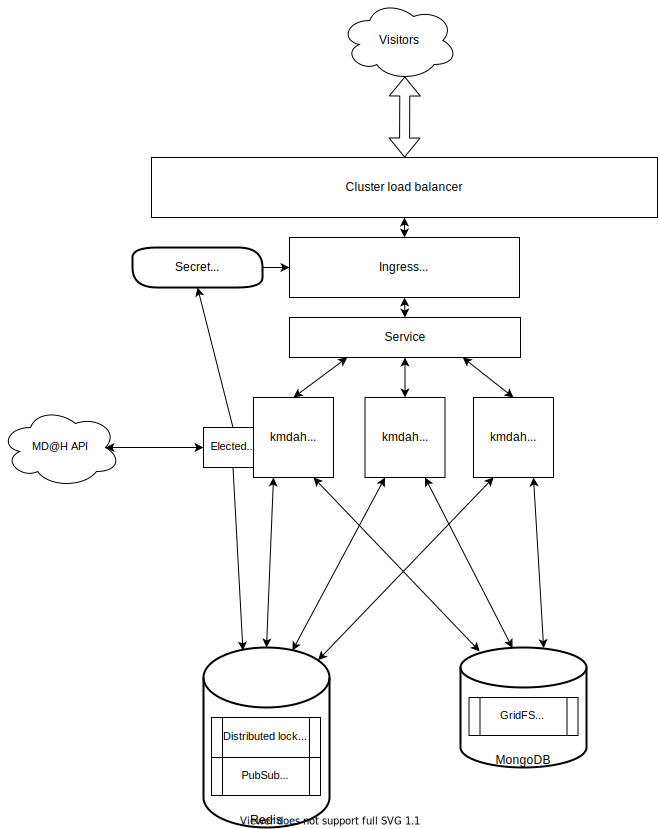

# kmdah

A distributed-first mangadex@home (MD@H) client implementation.

## Architecture overview

To run multiple instances of a single client, we need a few things:

- A consistent heartbeat to the MD@H backend to avoid compromission/inconsistent queries: Redis locks and Redis PubSub
- A way to handle SSL termination at the cluster level: see [SSL termination](#ssl-termination)
- A storage backend supporting multiple RW consumers: see [Storage backends](#ssl-termination)

This is an example of configuration result:



## Getting started

While you probably should read this document to get on, you can also jump straight into the [examples](docs/examples) if you prefer.

The configuration can be done either via environment variables or with a yaml configuration file (from a ConfigMap for example).

The order of precedence is as follows (the lower down the list, the higher priority for overriding):

- Default value
- Environment variable
- Explicit yaml configuration key

The default values are in [application.yml](src/main/resources/application.yml) under `kmdah`.

## Redis

First, we need to install and start [Redis](https://redis.io/) somewhere. It could be in the cluster, or outside it. The latter is probably preferable.

As we do not store any actual data in it, a few megabytes of RAM and a very small bit of CPU is enough for our purposes.

Redis Sentinel is currently not officially supported, mostly because it hasn't been tested.

### Relevant configuration

```yaml
kmdah:
  gossip:
    id-generation-strategy: ${KMDAH_GOSSIP_ID_GENERATION_METHOD:random_uuid}
    redis:
      host: ${KMDAH_GOSSIP_REDIS_HOST:localhost}
      port: ${KMDAH_GOSSIP_REDIS_PORT:6379}
      gossip-topic: ${KMDAH_GOSSIP_REDIS_TOPIC:kmdah}
      lock-registry-key: ${KMDAH_GOSSIP_REDIS_LOCK_REGISTRY_KEY:kmdah-leadership}
```

#### `kmdah.gossip.id-generation-strategy`

Each instance must have a unique identity.

You can use any of the [identity generation strategies](src/main/java/moe/tristan/kmdah/service/gossip/InstanceId.java):

- `random_uuid` to generate one on startup
- `hostname` to use the container's hostname

#### `kmdah.gossip.redis.{host, port, gossip-topic, lock-registry-key}`

The `host` and `port` define where the instances should find the shared redis to connect to.

The `gossip-topic` is the [Redis PubSub topic/channel](https://redis.io/topics/pubsub) that instances will use for communications between each other.

The `lock-registry-key` is the name of the [Redis DistLock](https://redis.io/topics/distlock) that will serve for elections of the cluster leader instance.

---

If your redis has authentication enabled, you can add the following **at the root** of your configuration file:

```yaml
spring:
  redis:
    username: myuser
    password: some-password
```

## SSL Termination

On start, the client receives its SSL certificate from the backend and needs a way to configure the cluster with it.

### Relevant configuration

```yaml
  tls:
    backend: ${KMDAH_TLS_BACKEND:unset}
    file:
      certificate-output-file: ${KMDAH_TLS_FILE_CERTIFICATE_OUTPUT_FILE:tls.crt}
      private-key-output-file: ${KMDAH_TLS_FILE_PRIVATE_KEY_OUTPUT_FILE:tls.key}
    k8s:
      secret:
        auto-update: ${KMDAH_TLS_K8S_SECRET_AUTO_UPDATE:false}
        name: ${KMDAH_TLS_K8S_SECRET_NAME:secret-name}
        namespace: ${KMDAH_TLS_K8S_SECRET_NAMESPACE:default}
```

#### `kmdah.tls.backend`

There are 2 [backends](src/main/java/moe/tristan/kmdah/service/tls/TlsBackend.java) available.

1. The `k8s` backend: auto-configuring the Certificate resource used by the Ingress.

   When the leader of the cluster receives the certificate, it updates a Certificate's Secret resource.

   a. First, we need a [ServiceAccount](docs/examples/kubernetes/serviceaccount.yml).

   b. Then, this ServiceAccount should have correct [RBAC permissions](docs/examples/kubernetes/rbac.yml) for Kmdah to have `UPDATE` (and optionally `CREATE`)
   permissions on the Secret resource.

   c. This might require editing the RBAC or pre-creating the Secret with the [sample fake cert resource](docs/examples/kubernetes/initial-tls-secret.yaml)
   depending on your cluster's RBAC configuration.

   d. Then, ensure your [Ingress](docs/examples/kubernetes/ingress.yml) is configured to use that secret for TLS.

2. The `file` backend:

##### `k8s.secret.auto-update`

To avoid mistakenly breaking your production configuration, this is set to `false` by default. Effectively rendering this backend completely disabled.

Set it to `true` when you have validated that the application works (with a separate ingress dedicated to testing).

### `file` backend: Output certificate and private key to a location

If you prefer to handle setting these certificates manually for some reason (if you are using nginx as a reverse proxy outside k8s for example).

