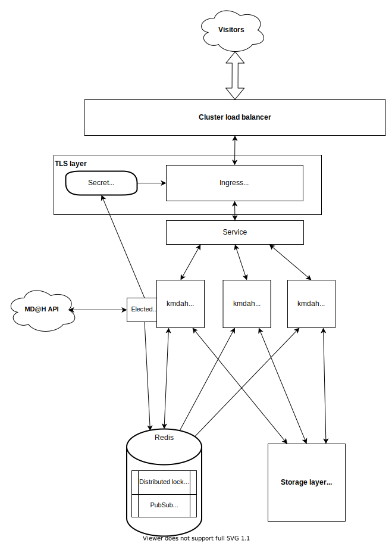

# kmdah

A distributed-first MangaDex@Home (MD@H) client implementation for ~~web~~ meme scale (that's when you misread the "home" part of the project as "datacenter").

## Overview

To run multiple instances of a single client, you need to:

1. Regularly ping the MD@H backend without causing compromission or sending inconsistent requests

   See gossipping and distributed elections via [Redis](#redis)

2. Support multiple read-write consumers at the storage level

   See multi-consumer persistent [storage](#storage) options available

3. Handle SSL termination at the cluster level

   See [dynamically updated](#ssl-termination) Ingress Certificate Secret



## Introduction

Additionally, this document, and kmdah in general, assume prior knowledge of Kubernetes. If that is not the case, feel free to ask for help in the
`#support-md-at-home` channel.

You can also jump straight into the [examples](docs/examples) and only refer to this document passively if that is your preference.

## Getting started

The configuration can be done either via environment variables or with a yaml configuration file (from a ConfigMap for example).

The order of precedence is as follows (the lower down the list, the higher priority for overriding):

- Default value
- Environment variable
- Explicit yaml configuration key

The default values are in [application.yml](src/main/resources/application.yml#L77) under `kmdah`.

## MangaDex client configuration

```yaml
kmdah:
  mangadex:
    client-secret: ${KMDAH_MANGADEX_CLIENT_SECRET:asuka>rei}
    load-balancer-ip: ${KMDAH_MANGADEX_LOAD_BALANCER_IP:unset}
    bandwidth-mbps: ${KMDAH_MANGADEX_BANDWIDTH_MBPS:500}
    enforce-tokens: ${KMDAH_MANGADEX_ENFORE_TOKENS:false}
```

`client-secret` and `bandwidth-mbps` should be self-explanatory

`load-balancer-ip` is the IP of the load-balancer that you want users to access kmdah through

`enforce-tokens` forces validation of tokens (to avoid aggregator websites hotlinking to your client). It is recommended to set it to `true`

## Worker configuration

```yaml
kmdah:
  worker:
    port: ${KMDAH_WORKER_PORT:8080}
```

This is the port on which the instance will bind inside the docker container. Must match the container port in your Pod's manifest.

## Redis

To begin with, install and start [Redis](https://redis.io/) somewhere. It could be in the cluster, or outside it. The latter is probably preferable.

As kmdah does not store any actual data in it, a few megabytes of RAM and a very small bit of CPU is enough for our purposes.

Note that Redis Sentinel is currently not supported yet.

### Kmdah configuration snippet for Redis

```yaml
kmdah:
  gossip:
    id-generation-strategy: ${KMDAH_GOSSIP_ID_GENERATION_METHOD:random_uuid}
    redis:
      host: ${KMDAH_GOSSIP_REDIS_HOST:localhost}
      port: ${KMDAH_GOSSIP_REDIS_PORT:6379}
      gossip-topic: ${KMDAH_GOSSIP_REDIS_TOPIC:kmdah}
      lock-registry-key: ${KMDAH_GOSSIP_REDIS_LOCK_REGISTRY_KEY:kmdah-leadership}
```

---

If your redis has authentication enabled, you can add the following at the root of your configuration file (not under `kmdah`):

```yaml
spring:
  redis:
    username: myuser
    password: some-password
```

#### `kmdah.gossip.id-generation-strategy`

Each instance must have a unique identity and can do so
via [identity generation strategies](src/main/java/moe/tristan/kmdah/service/gossip/InstanceId.java#L32-L35):

- `random_uuid` to generate one on startup
- `hostname` to use the container's hostname

#### `kmdah.gossip.redis.{host, port, gossip-topic, lock-registry-key}`

The `host` and `port` define where the instances should find the shared redis to connect to.

The `gossip-topic` is the [Redis PubSub topic/channel](https://redis.io/topics/pubsub) that instances will use for communications between each other. It is
recommended to leave it as-is.

The `lock-registry-key` is the name of the [Redis DistLock](https://redis.io/topics/distlock) that will serve for elections of the cluster leader instance. It
is recommended to leave it as-is.

## Storage

To save cost, it is ideal to share storage amongst instances. While it is of course possible to have completely different storage pools for each instance, that
means duplication and potentially very high cost, especially if each copy needs to be redundant and highly-available.

Thankfully, kmdah is designed specifically to not need this.

Distributed high-performance storage is a broad topic, with many options available. Each of these listed in [Tested storage backends](#tested-storage-backends)
has been extensively tested and along each you will find retrospective thoughts and recommendations/warnings where applicable.

### Configuration common to all storage backends

```yaml
kmdah:
  cache:
    backend: ${KMDAH_CACHE_BACKEND:unset}
    max-size-gb: ${KMDAH_CACHE_MAX_SIZE_GB:100}
    abort-lookup-threshold-millis: ${KMDAH_CACHE_ABORT_LOOKUP_THRESHOLD_MILLIS:500}
  ...
```

#### `kmdah.cache.{backend, max-size-gb, abort-lookup-threshold-millis}`

There are 3 [`backend`](src/main/java/moe/tristan/kmdah/service/images/cache/CacheBackend.java)s available:

1. The `filesystem` backend

   Use with: [NFSv4](#nfsv4), [CephFS](#cephfs)

   Refers to a cache managed by kmdah and exposed to it as a directory path

2. The `mongodb` backend

   Use with: [MongoDB](#mongodb) standalone, ⚠ [MongoDB](#mongodb) sharded replicaset

   Refers to a cache managed by kmdah and exposed to it as a MongoDB instance

3. The `delegating` backend

   Use with: don't use it unless you need it

   Refers to kmdah not serving images nor managing the cache. This is implemented specifically to be able to run kmdah as a pseudo-client. Seek advice
   on `#support-md-at-home` if you think this is for you.

The `max-size-gb` is an integer, and refers to the maximal size in gibibytes (1 GiB = 1024 MiB) of the cache before deleting the oldest files in it. The size is
checked periodically (every 15 minutes), so this is effectively a "best-effort" setting. In practice, the cache will always be slightly bigger between cleanups
due to new files. Recommended is to put 90% of the disk space you actually want to commit to MDAH.

The `abort-lookup-threshold-millis` is the maximal amount of milliseconds to wait for a response from the underlying storage before giving up and treating a
request as a cache MISS. If your storage is stressed, rather than piling up on this, this gives it a bit of breathing room to come back to life. It is
recommended to leave it as-is.

### Configuration for filesystem storage

```yaml
kmdah:
  cache:
    backend: filesystem
    ...
    filesystem:
      root-dir: ${KMDAH_CACHE_FILESYSTEM_ROOT_DIR:}
      read-only: ${KMDAH_CACHE_FILESYSTEM_READ_ONLY:false}
```

The `root-dir` is a filesystem path (and must be an absolute one) wherein kmdah will store images. kmdah must have read and write permissions on that directory.

The `read-only` property allows disabling cache management. This is not needed and should be kept to default (`false`) unless you already have a full copy of
the image set that you keep up to date by other means. This was implemented solely for MD@H upstream needs.

### Configuration for MongoDB storage

```yaml
kmdah:
  cache:
    backend: mongodb
    mongodb:
      host: ${KMDAH_CACHE_MONGODB_HOST:localhost}
      port: ${KMDAH_CACHE_MONGODB_PORT:27017}
      authentication-database: ${KMDAH_CACHE_MONGODB_AUTHENTICATION_DATABASE:admin}
      username: ${KMDAH_CACHE_MONGODB_USERNAME:kmdah}
      password: ${KMDAH_CACHE_MONGODB_PASSWORD:kmdah}
```

These should be fairly self-explanatory.

Note that you cannot unset `username` or `password` because:

- MongoDB shouldn't be used without authentication
- it was annoying to allow

You will need to:

- enable authorization in MongoDB's configuration

```yaml
security:
  authorization: enabled
```

- create a user for kmdah with all permissions on the `fs.files` and `fs.chunks` collections of the default database

If you don't operate a MongoDB instance, or plan to dedicate it to mdah, you can do so with the following in the `mongo` CLI:

<!-- @formatter:off -->
```js
> use admin

> db.createUser({
    user: "kmdah",
    pwd: "verysecure",
    roles: [{role: "root", db: "admin"}]
})
```
<!-- @formatter:on -->

You can then test that the user was created correctly by running `mongo -u kmdah` and seeing if you can log in.

---

If you want to override the database/buckets used, add this at the root of the configuration

```yaml
spring:
  data:
    mongodb:
      gridfs:
        database: mydatabase
        bucket: mybucket
```

### Tested storage backends

Reported performance characteristics, unless indicated otherwise, are always:

- in a LAN environment with 10Gbps full-duplex connectivity between kmdah instances and storage servers
- with real live traffic, and thus without much benefit from the Linux kernel's file caching

#### NFSv4

**Backend type:** `filesystem`

The first solution is the ubiquitous standard for shared filesystems, NFS.

##### Pros

- Simple to set up

##### Cons

- Poor support in Kubernetes
- Poor performance
- High CPU usage

##### Conclusion

Unfortunately, NFS has consistently poor performance along with very high CPU consumption for the host nodes. At 200 req/s (~1Gbps):

- 24% of CPU time was lost to the NFS client,
- latency regularly spiked to multiple 100s of milliseconds.

In testing, it became clear that NFS is not suitable above the 150rqps range.

**Recommended:** No, unless you expect less than 100 req/s.

##### Example Kubernetes manifest

```yaml
apiVersion: v1
kind: PersistentVolume
metadata:
  name: kmdah-pv
  namespace: kmdah
spec:
  capacity:
    storage: 2Ti
  accessModes:
    - ReadWriteMany
    - ReadWriteOnce
    - ReadOnlyMany
  nfs:
    server: 192.168.2.3
    path: "/nfs/cache"
  mountOptions:
    - noatime       # strongly recommended
    - nodiratime    # strongly recommended
    - async         # recommended
    - noacl         # recommended
    - nocto         # recommended
    - rsize=32768   # optional, if present it must match the server side
    - wsize=32768   # optional, if present it must match the server side
```

#### CephFS

**Backend type:** `filesystem`

[Ceph](https://ceph.io/) is an infinitely scalable solution for distributed storage. CephFS is able to sustain concurrent reads and writes by multiple consumers
to a single filesystem.

##### Pros

- Very fast
- No noticeable CPU overhead
- Strong concurrency guarantees
- You're literally using the same storage tech as CERN

##### Cons

- Requires a pre-existing Ceph cluster, which is either costly or at least more involved to set up
- Requires MTU 9000 for best performance

##### Conclusion

CephFS has shown it is capable of handling at least 600 req/s without noticeable CPU overhead nor latency spikes.

We have not yet tested it for MDAH yet above these speeds at the time of writing,
but [institutional users have pushed it to multiple 100s of Gbps and millions of iops](https://www.vi4io.org/io500/list/20-11/10node).

**Recommended: Yes, if you want to achieve extremely high performance.**

##### Example Kubernetes manifest

```yaml
volumes:
  - name: cache
    cephfs:
      user: mangadex
      secretRef:
        name: ceph-secret
      monitors:
        - 1.2.3.101:6789
        - 1.2.3.102:6789
        - 1.2.3.103:6789
      path: /volumes/standard/mangadex/cache
```

#### MongoDB

**Backend type:** `mongodb`

While [MongoDB](https://www.mongodb.com/), a database, might not strike you as a viable option for massive file storage, it turns out to be a very solid
middle-ground solution in practice ; specifically using its [GridFS](https://docs.mongodb.com/manual/core/gridfs/) feature.

This bit is relevant to both single-instance and sharded replicaset configurations.

##### Pros

- Relatively simple to set up
- Very fast
- No noticeable CPU overhead

##### Cons

- Cannot use sharding easily

##### Conclusion

I have personally been running my own client on MongoDB for months now, and was able to scale it up to 350 req/s (~2Gbps) without noticeable degradation of
performance.

Notes:

- ⚠ Do **not** use it if your underlying block device is backed by ZFS. MongoDB works best on XFS, and XFS over ZFS-backed block storage has very poor
  performance.
- ⚠ Unless you plan to store the full archive (~17TB at the time of writing), proceed with caution when using MongoDB sharding, as cache pruning will cause your
  shards to [become unbalanced overtime](https://jira.mongodb.org/browse/SERVER-2487) if your sharding key is the file id (explanations available on-demand)

**Recommended: Yes.**

## SSL Termination

As part of heartbeat, the leader receives an SSL certificate and assigned domain from the backend.

It then needs a way to configure the cluster with it.

To be more precise, the domain is made of 3 parts:

- The current temporary client-specific subdomain
- A never-changing MangaDex account subdomain
- `.mangadex.network` as TLD

Your url is thus in the form: `<random>.<account specific>.mangadex.network`

The certificate is a wildcard certificate for the subject `*.<account specific>.mangadex.network`

### Common TLS configuration

```yaml
kmdah:
  tls:
    backend: ${KMDAH_TLS_BACKEND:unset}
    ...
```

There are 2 [`backend`](src/main/java/moe/tristan/kmdah/service/tls/TlsBackend.java)s available to configure SSL:

1. The [`k8s` backend](#k8s-backend-configuration)

   When the leader of the cluster receives the certificate, it updates a Certificate's Secret resource, which is picked up by your Ingress controller:

   a. Create a [ServiceAccount](docs/examples/kubernetes/serviceaccount.yml).

   b. Grant this ServiceAccount the [RBAC permissions](docs/examples/kubernetes/rbac.yml) to `UPDATE` (and optionally `CREATE`)
   the Secret resource. This might require editing the RBAC manifests or pre-creating the Secret with
   the [sample fake cert resource](docs/examples/kubernetes/initial-tls-secret.yaml)
   depending on your cluster's RBAC configuration.

   c. Then, ensure your [Ingress](docs/examples/kubernetes/ingress.yml) is configured to use that secret for TLS.

2. The [`file` backend](#file-backend-configuration)

   If you prefer to handle setting these certificates manually for some reason (if you are using nginx as a reverse proxy outside k8s for example), this backend
   simply outputs the content of the certificate and private key in a directory.

   Note: **only the current leader outputs the certificate** files, **not** all instances.

#### `k8s` backend configuration

```yaml
kmdah:
  tls:
    backend: k8s
    k8s:
      secret:
        auto-update: ${KMDAH_TLS_K8S_SECRET_AUTO_UPDATE:false}
        namespace: ${KMDAH_TLS_K8S_SECRET_NAMESPACE:default}
        name: ${KMDAH_TLS_K8S_SECRET_NAME:secret-name}
```

To avoid mistakenly breaking your production configuration, `auto-update` is set to `false` by default. This effectively means that this backend does nothing to
your cluster, and you must set it to `true` when you are ready to go to production.

Then, `namespace` and `name` act like a SecretRef. Note that the secret usually must be in the same namespace as the Ingress that uses it unless you have
specifically tweaked your cluster's RBAC configuration.

Note that the sample manifests assume the `kmdah` namespace and `mangadex-at-home-tls-secret` name.

#### `file` backend configuration

```yaml
kmdah:
  tls:
    backend: file
    file:
      certificate-output-file: ${KMDAH_TLS_FILE_CERTIFICATE_OUTPUT_FILE:tls.crt}
      private-key-output-file: ${KMDAH_TLS_FILE_PRIVATE_KEY_OUTPUT_FILE:tls.key}
```

You may use either a relative (to the process' working directory) or absolute path.

Notes:

- Intermediate directories are **not** automatically created
- The ownership and permissions will be those of the Java process

## Metrics configuration

```yaml
kmdah:
  geoip:
    enabled: ${KMDAH_GEOIP_ENABLED:false}
    license-key: ${KMDAH_GEOIP_LICENSE_KEY:unset}
```

If you want to get metrics for countries, set `enabled` to `true` and input your (free) license key from [MaxMind](https://www.maxmind.com/) for GeoIP 2 Lite.
